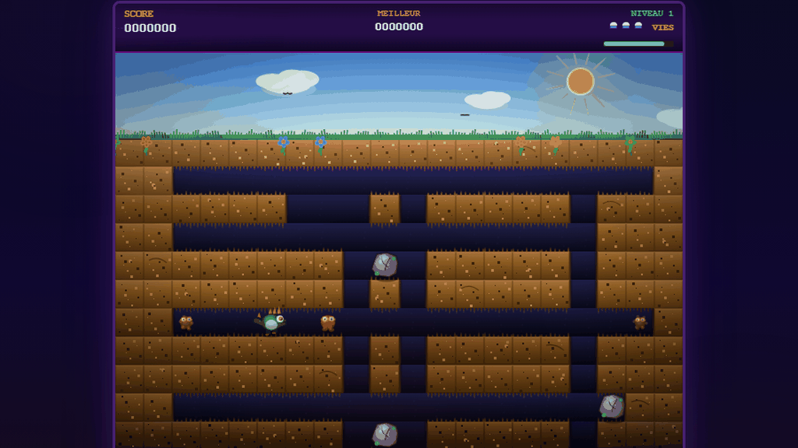

# Gonfle-Taupe

**L'aventure souterraine. Creusez, gonflez, écrasez.**

Joue ici : [games.hylst.fr/gonfletaupe/](https://games.hylst.fr/gonfletaupe/)



## Comment on joue

Vous creusez vos propres tunnels sous terre pour traquer des monstres. Deux façons de s'en
débarrasser :

- **La pompe** — visez un monstre et maintenez Espace : un tuyau s'étend et s'accroche à lui.
  Continuez à pomper pour le gonfler jusqu'à ce qu'il explose.
- **Les rochers** — creusez la case juste sous un rocher instable pour le faire tomber sur
  un monstre qui passe dessous. Efficace, mais ça marche aussi sur vous si vous n'êtes pas
  prudent.

Les fantômes (état intermittent des monstres normaux) traversent la terre, mais jamais les
rochers. Les Fygars, les dragons verts, crachent du feu à l'horizontale : gardez vos
distances à leur hauteur.

## Contrôles

| Action | Touche |
|--------|--------|
| Se déplacer | Flèches ou ZQSD |
| Creuser | Maintenir Maj (ou souris/tactile) en se déplaçant vers de la terre |
| Pomper | Espace |
| Pause | P |

## Ce qu'il y a dedans

- Niveaux générés avec tunnels, petites salles et rochers en positions variées
- Deux types de monstres (pooka, fygar) avec IA de poursuite, mode fantôme temporaire et
  fuite du dernier survivant
- Système de combo sur les éliminations rapprochées, jusqu'à ×5
- Légumes bonus et power-ups (vitesse, invincibilité, double points, vie supplémentaire)
- Bonus de temps et bonus « parfait » (aucun monstre manqué) à la fin de chaque niveau
- Musique chiptune procédurale et effets sonores en Web Audio

## L'arborescence

```
gonfle-taupe-game-development/
├── index.html          # template + bloc SEO
├── vite.config.ts      # base '/gonfletaupe/' + singlefile
├── public/
│   ├── favicon.png
│   ├── og-image.png / og-image.webp
│   └── icon.webp        # carte du menu, 128x128
└── src/
    ├── main.tsx
    ├── App.tsx           # ecrans menu/jeu/game over
    └── game/
        ├── DigDugGame.tsx  # boucle de jeu (requestAnimationFrame), entrees clavier/souris
        ├── gameEngine.ts   # LOGIQUE PURE : generation, joueur, ennemis, rochers, pompe
        ├── renderer.ts     # tout le rendu canvas
        └── audio.ts        # synthese Web Audio
```

## Dev

```bash
npm install
npm run dev       # http://localhost:5173/gonfletaupe/
npm run build     # dist/index.html, un seul fichier
npm run preview
```

## Stack

React 19, TypeScript 5.9 (strict), Tailwind CSS 4, Vite 7, vite-plugin-singlefile.

Zéro backend, zéro image sprite : tout est dessiné en Canvas 2D, les sons sont synthétisés
au vol.

## Licence

MIT, Geoffroy Streit (Hylst)
